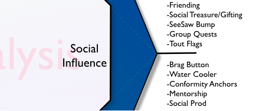

# Octalysis

The Octalysis Framework is a human-centric gamification design framework that lays out the eight core drives for humans motivation developed by Yu-Kai Chou. The framework is based on the premise that systems are “function-focused”, designed to complete a task as quickly as possible, similar to a factory process assuming workers will complete their tasks in a timely manner because they are required to do so. However, human-focused design acknowledges that people, unlike machines in a system have feelings, insecurities, and reasons why they want or do not want to do certain things, and therefore, optimizes for their feelings, motivations, and engagement.

The framework lays out the structure for analyzing the driving forces behind human motivation. It is the process of applying the core behavior drives that motivate a user to complete a task efficiently through an interactive experience. The Octalysis framework is used in healthcare, fitness, education, training, company, and product design to increase user engagement, ROI and motivation.

```{r fig.align='center', echo=FALSE, out.width = '90%'}

```


## Epic Meaning & Calling

Epic Meaning & Calling is the Core Drive where a player believes that he is doing something greater than himself or he was “chosen” to do something. A symptom of this is a player that devotes a lot of his time to maintaining a forum or helping to create things for the entire community (think Wikipedia or Open Source projects). This also comes into play when someone has “Beginner’s Luck” – an effect where people believe they have some type of gift that others don’t or believe they were “lucky” to get that amazing sword at the very beginning of the game.


```{r fig.align='center', echo=FALSE, out.width = '75%'}

```

## Development & Accomplishment

Development & Accomplishment is the internal drive of making progress, developing skills, and eventually overcoming challenges. The word “challenge” here is very important, as a badge or trophy without a challenge is not meaningful at all. This is also the core drive that is the easiest to design for and coincidently is where most of the PBLs: points, badges, leaderboards mostly focus on.

```{r fig.align='center', echo=FALSE, out.width = '75%'}

```

## Empowerment of Creativity & Feedback

Empowerment of Creativity & Feedback is when users are engaged in a creative process where they have to repeatedly figure things out and try different combinations. People not only need ways to express their creativity, but they need to be able to see the results of their creativity, receive feedback, and respond in turn. This is why playing with Legos and painting are fun in-and-of themselves and often become Evergreen Mechanics, where a game-designer no longer needs to continuously add more content to keep the activity fresh and engaging.

```{r fig.align='center', echo=FALSE, out.width = '75%'}

```

## Ownership & Possession

This is the drive where users are motivated because they feel like they own something. When a player feels ownership, she innately wants to make what she owns better and own even more. Besides being the major core drive for wanting to accumulate wealth, this deals with many virtual goods or virtual currencies within systems. Also, if a person spends a lot of time to customize her profile or her avatar, she automatically feels more ownership towards it too. Finally, this is also the core drive that makes collecting stamps or puzzle pieces fun.

```{r fig.align='center', echo=FALSE, out.width = '75%'}

```

## Social Influence & Relatedness

This drive incorporates all the social elements that drive people, including: mentorship, acceptance, social responses, companionship, as well as competition and envy. When you see a friend that is amazing at some skill or owns something extraordinary, you become driven to reach the same level. Also, it includes the drive we have to draw closer to people, places, or events that we can relate to. If you see a product that reminds you of your childhood, the sense of nostalgia would likely increase the odds of you buying the product. This Core Drive is relatively well-studied too, as many companies these days are putting a lot of priority on optimizing their online social strategies.

```{r fig.align='center', echo=FALSE, out.width = '75%'}

```

## Scarcity & Impatience

This is the drive of wanting something because you can’t have it. Many games have Appointment Dynamics (come back 2 hours later to get your reward) – the fact that people can’t get something right now motivates them to think about it all day long. This is the Core Drive utilized by Facebook when it first started: at first it was just for Harvard. Then it opened up to a few other prestigious schools, and eventually all colleges. When it finally opened up to everyone, many people wanted to join because they previously couldn’t get in it.

```{r fig.align='center', echo=FALSE, out.width = '75%'}

```

## Unpredictability & Curiosity

Generally, this is a harmless drive of wanting to find out what will happen next. If you don’t know what’s going to happen, your brain is engaged and you think about it often. Many people watch movies or read novels because of this drive. However, this drive is also the primary factor behind gambling addiction. Also, this core drive is utilized whenever a company runs a sweepstake or lottery program to engage users. The very controversial Skinner Box experiments, where an animal irrationally presses a lever frequently because of unpredictable results, are exclusively referring to the core drive of Unpredictability & Curiosity, although many have misunderstood it as the driver behind points, badges, and leaderboard mechanics in general.

```{r fig.align='center', echo=FALSE, out.width = '75%'}

```

## Loss & Avoidance

This core drive is based upon the avoidance of something negative happening. On a small scale, it could be to avoid losing previous work. On a larger scale, it could be to avoid admitting that everything you did up to this point was useless because you are now quitting. Also, opportunities that are fading away have a strong utilization of this Core Drive, because people feel like if they didn’t act immediately, they would lose the opportunity to act forever.

```{r fig.align='center', echo=FALSE, out.width = '75%'}

```

## Features of Octalysis 

### Left Brain vs Right Brain Core Drives

Within Octalysis, the Core Drives on the right are Right Brain Core Drives, being more related to creativity, self-expression, and social aspects.

The Core Drives on the left are Left Brain Core Drives, being more associated to logic, calculations, and ownership.

Note: the Left Brain/Right Brain Core Drives are not considered true brain science; they are merely symbolic as it makes the framework easier and more effective when designing. It’s useful dividing things up between the logical and the emotional, and I just named them Left Brain/Right Brain Core Drives so people can remember them easily.

Interestingly, Left Brain Core Drives are Extrinsic Motivators – you are motivated because you want to obtain something, whether it be a goal, a good, or anything you cannot obtain; on the other hand, Right Brain Core Drives are Intrinsic Motivators: you don’t need a goal or reward to use your creativity, hangout with friends, or feel the suspense of unpredictability – the activity itself is rewarding on its own.

This is important, because many companies aim to design for motivation based on Extrinsic Motivators, such as giving users a reward at the end. However, many studies have shown that once you stop offering the extrinsic motivator, user motivation will often decrease to much lower than before the extrinsic motivator was first introduced.

It’s much better for companies to design experiences that motivate the Right Brain Core Drives, making something in of itself fun and rewarding, so users continuously engage in the activity.

```{r fig.align='center', echo=FALSE, out.width = '75%'}

```


### White Hat vs Black Hat Gamification

Another element to note within Octalysis is that the top Core Drives in the octagon are considered very positive motivators, while the bottom Core Drives are considered negative motivators.

Techniques that utilize the top Core Drives are called “White Hat Gamification”,while techniques that utilize the bottom Core Drives are called “Black Hat Gamification”.

If something is engaging because it lets you express your creativity, makes you feel successful through skill mastery, and gives you a higher sense of meaning, it makes users feel very good and powerful.

On the other hand, if you are always doing something because you don’t know what will happen next, you are constantly in fear of losing something, or because there are things you can’t have, even though you would still be extremely motivated to take the actions, it can often leave a bad taste in your mouth.

The problem with Zynga games, according to the Octalysis framework, is that they have figured out how to do many Black Hat Game Techniques, which drive up revenue numbers from users, but it doesn’t make users feel good. So when a user is finally able to leave the system, they will want to, because they don’t feel like they are in control over themselves, just like gambling addiction.

Keep in mind that just because something is Black Hat doesn’t mean it is necessarily bad – these are just motivators – and they can be used for productive and healthy results or malice and manipulative ones. Many people voluntarily submit themselves into Black Hat Gamification in order to go to the gym more often, eat healthy, or avoid hitting the snooze button every morning.

A good Gamification expert will consider all 8 Core Drives on a positive and productive activity so that everyone ends up happier and healthier.

```{r fig.align='center', echo=FALSE, out.width = '90%'}

```


### Octalysis Score

Keep in mind that a good gamified system doesn’t need to have all of the Core Drives, but it does need to do really well with the ones it does implement. Some extremely successful products do very, very well with Social Influence, while others just utilize Scarcity.

In order to come up with an Octalysis score, you take how good the subject of analysis is in each core drive, assign a number between 0-10 based on personal judgement, data, and experience flows, and then square that number to get the Core Drive Score. Once you add up all 8 Core Drive Scores, you will get your final Octalysis Score.

Of course, the Score itself is not very useful or actionable, so I always tell my clients to focus on what Core Drive is lacking, instead of being obsessed with their “score.”

## How to apply Octalysis to actual systems

Now that we have the Gamification Framework laid out, the next step is to figure out how to utilize this framework. Generally, any good and engaging product or system will have at least one of the core drives listed above.

The way to use Octalysis is to identify all the game mechanics that are used to appeal to each Core Drive and list it next to the Core Drive of the Octagon. Afterwards, based on how strong these game mechanics are, each side of the Octagon will expand or retract.

If a side crosses the inside Octagon, then that side is extremely weak and the Gamification expert needs to improve on that area. Of course, this is all very abstract, so lets look at a few examples.


## Octalysis Examples


### Quora (website)


### Super Mario Bros


### Facebook