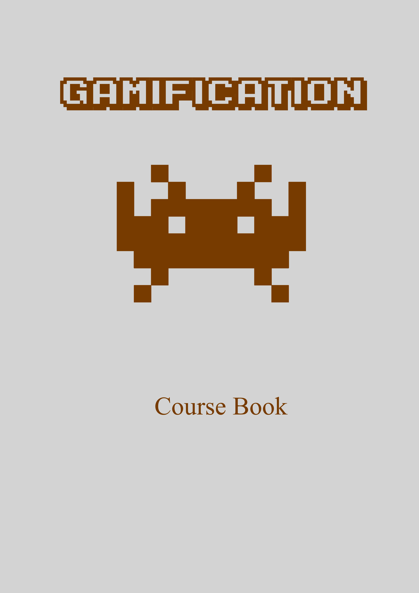

--- 
title: "Gamification Course Book"
author: "Kulbhushan Chand"
date: "`r Sys.Date()`"
site: bookdown::bookdown_site
output: bookdown::gitbook
documentclass: book
bibliography: [references.bib]
biblio-style: apalike
link-citations: yes
#github-repo: 
description: "This is a course book accompanying the ECX-488: Gamification course at NITJ."
cover-image: assets/images/book-cover.jpg
#url: 'https\://bookdown.org/kulbhushanchand/ShreeRamcharitmanas/'
---

# Preface {#preface -}

```{r fig.align='center', echo=FALSE, out.width = '75%'}

```

This is a course book accompanying the ECX-488: Gamification course at Dr B R Ambedkar National Institute of Technology.


## About the course {#course -}

The `ECX-488: Gamification` course runs every semester at NITJ. This is an open-elective course meant for final year engineering students. THe main aim of the course is -

- To familiarize with concepts of Gamification.
- Understanding Gamification through various case studies.
- To put Gamification into use for solving real-world problems via various practical assignments. 
- Publish results obtained from practical assignments. 


**Course Instructor:**  
Prof. Arun Khosla   
*Webpage: https://www.nitj.ac.in/index.php/nitj_cinfo/Faculty/38*  


**Teaching Assistant:**  
Kulbhushan Chand  
*Webpage: https://kulbhushanchand.github.io*  


